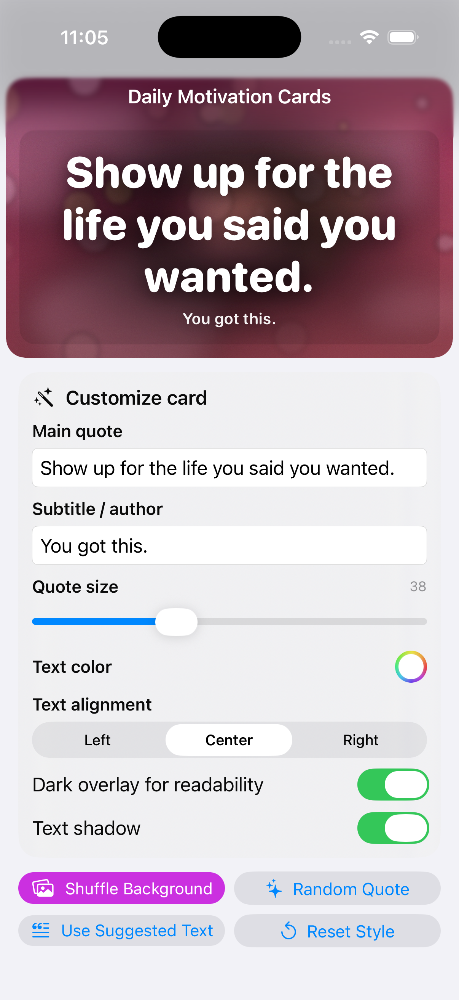
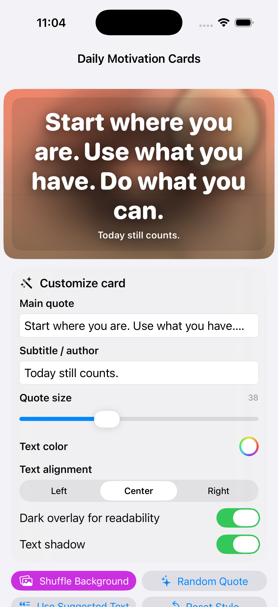
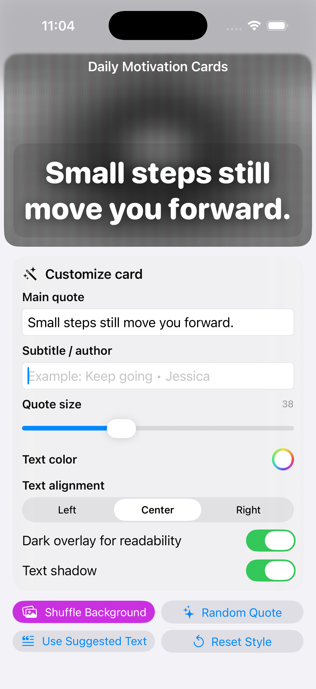

# iOS Meme Creator

A SwiftUI app for creating motivational and meme-style image cards with customizable text, styling controls, and a polished interactive interface.

## Overview

This project was built as part of my iOS development portfolio to demonstrate creative interface design in SwiftUI. The app allows users to generate and customize visual quote cards by editing text, adjusting styling, and experimenting with different visual outputs in a clean mobile workflow.

## Features

- Create custom motivational card designs
- Edit main quote and subtitle text
- Adjust quote size
- Change text alignment
- Toggle dark overlay for readability
- Toggle text shadow
- Shuffle backgrounds and reset style options
- Explore multiple card looks in one app

## Built With

- Swift
- SwiftUI
- Xcode

## Screenshots

### Main Card Screen
Shows a polished motivational card with built-in text and visual styling.

### Custom Card Screen
Shows the customization interface where users can edit text, styling, and visual settings.

### Alternate Style Screen
Shows another card variation to highlight the app’s flexibility and different design outcomes.

## What This Project Demonstrates

- SwiftUI layout design
- Creative app development
- State-driven UI updates
- Interactive customization controls
- User-focused visual design
- Dynamic text and style presentation

## Why I Built It

I wanted to build a more creative SwiftUI project that went beyond utility-based app design. This app gave me the chance to practice customization, state management, and visual presentation while creating something that feels interactive, polished, and engaging.

## Status

Completed as a portfolio iOS project.

## Author

**Jessica Vargas**  
Data Analytics Student | App Developer 
